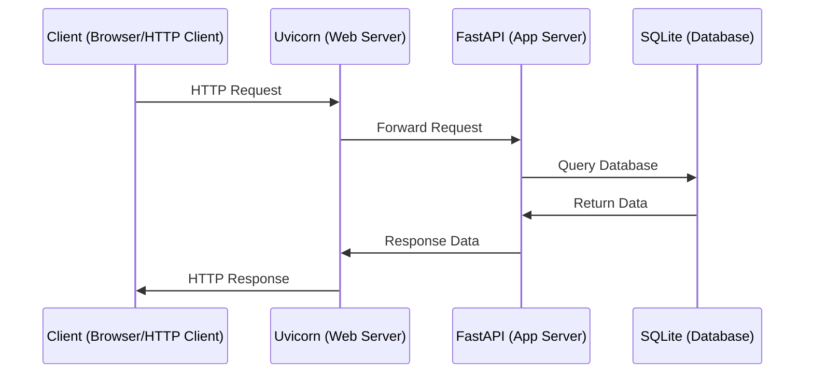

# url_shortner
A simple URL Shortner in Python with FastAPI and SQLite

## Key points
- REST API using **FastAPI**
- **Uvicorn** web server
- **SQLite** database
- **SQLAlchemy** for interaction with database
- CRUD interactions
- **pydantic** for data validation

## API overview
| Endpoint | HTTP Verb | Request Body | Action |
| ------ | ------ | ------ | ------ | 
| / | GET | | Returns a Hello, World! string |
| /url | POST | Your target URL | Shows the created url_key with additional info, including a secret_key |
| /{url_key} | GET | | Forwards to your target URL |
| /admin/{secret_key} | GET | | Shows administrative info about your shortened URL |
| /admin/{secret_key} | DELETE | Your secret key | Deletes your shortened URL |

